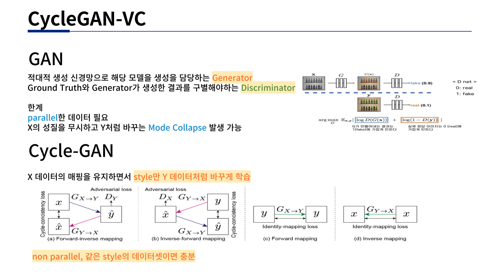
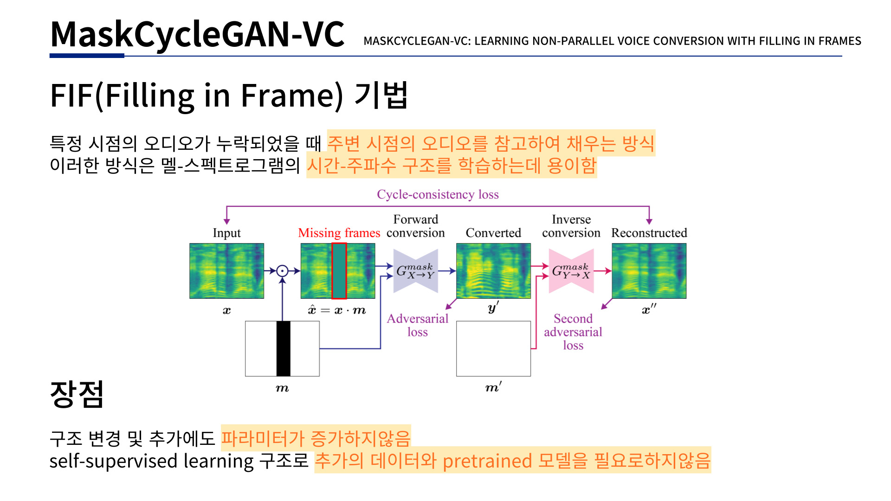
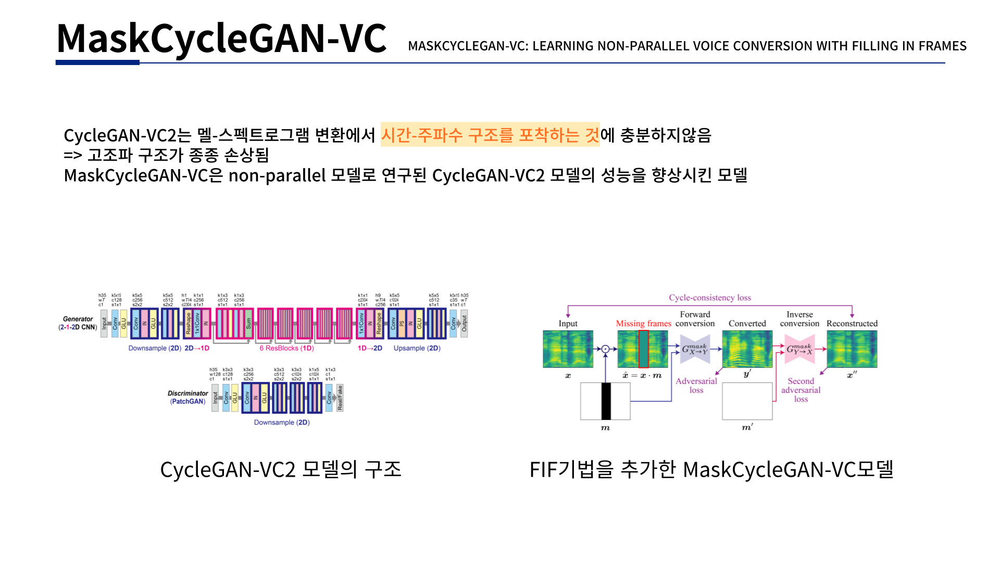

# MaskCycleGAN-VC-Korean
[**https://github.com/GANtastic3/MaskCycleGAN-VC**](https://github.com/GANtastic3/MaskCycleGAN-VC)의 repo를 가져와 재구현 및 외부 데이터 학습을 진행하였습니다.

원 repo에서 제공하는 Demo는 다음과 같습니다.

Unofficial **PyTorch** implementation of Kaneko et al.'s [**MaskCycleGAN-VC**](http://www.kecl.ntt.co.jp/people/kaneko.takuhiro/projects/maskcyclegan-vc/index.html) (2021) for non-parallel voice conversion.

MaskCycleGAN-VC는 CycleGAN을 사용한 non-parallel한 음성 변환을 위한 최신 방법입니다.

입력 Mel-spectrogram에 filling in frame(FIF)기법을 적용하여 훈련됩니다.

[**논문**](https://arxiv.org/abs/2102.12841)에서는 다음에 나열되는 CycleGAN-VC계열의 Voice Conversion 모델 중 MaskCycleGAN-VC에서 가장 성능이 좋다고 발표하였습니다. CycleGAN-VC (2018), CycleGAN-VC2 (2019), CycleGAN-VC3 (2020).

<p align="center">

<br>
</p>

<p align="center">

<br>
</p>

<p align="center">

<br>
</p>

Paper: https://arxiv.org/pdf/2102.12841.pdf


## Setup
환경설정입니다.
Clone the repository.

```
git clone https://github.com/mjcart/MaskCycleGAN-VC-Korean.git
cd MaskCycleGAN-VC
```

Create the conda environment.
```
conda env create -f environment.yml
conda activate MaskCycleGAN-VC
```

## VCC2018 Dataset
논문 저자는 VCC2018 Dataset을 사용했습니다. 해당 데이터셋으로 학습을 해보고 싶으시다면 따라하시면 됩니다.


Download the dataset from the command line.
```
wget --no-check-certificate https://datashare.ed.ac.uk/bitstream/handle/10283/3061/vcc2018_database_training.zip?sequence=2&isAllowed=y
wget --no-check-certificate https://datashare.ed.ac.uk/bitstream/handle/10283/3061/vcc2018_database_evaluation.zip?sequence=3&isAllowed=y
wget --no-check-certificate https://datashare.ed.ac.uk/bitstream/handle/10283/3061/vcc2018_database_reference.zip?sequence=5&isAllowed=y
```

Unzip the dataset file.
```
mkdir vcc2018
apt-get install unzip
unzip vcc2018_database_training.zip?sequence=2 -d vcc2018/
unzip vcc2018_database_evaluation.zip?sequence=3 -d vcc2018/
unzip vcc2018_database_reference.zip?sequence=5 -d vcc2018/
mv -v vcc2018/vcc2018_reference/* vcc2018/vcc2018_evaluation
rm -rf vcc2018/vcc2018_reference
```

## Data Set 추가하기
train_dataset 폴더안에 train_dataset_training폴더와 train_dataset_evaluation폴더가 있습니다.

각 폴더안에 <speaker_id(=사용할 데이터셋 이름)> 로 폴더 만들고 해당 폴더 안에 wav 파일 넣으면 됩니다.
(논문에서는 화자당 3~5초 데이터셋 80개 사용)

train_dataset_training/<speaker_id>/*.wav 는 학습에 사용될 데이터입니다.(학습에 사용되는 데이터)

train_dataset_evaluation/<speaker_id>/*.wav 는 inferece에 사용될 데이터입니다.(변환하고 싶은 음성 데이터)

## Data Preprocessing

학습을 진행하기전 데이터셋 전처리과정이 필요합니다.

waveform을 melspectogram으로 바꿔 <speaker_id>normalized.pickle으로 저장하고 normalization statistics(mean,std)를 <speaker_id>_norm_stats.npz으로 저장합니다.

```
python data_preprocessing/preprocess_vcc2018.py \
  --data_directory train_dataset/train_dataset_training \
  --preprocessed_data_directory train_dataset_preprocessed/train_dataset_training \
  --speaker_ids  <speaker_id(=사용할 데이터셋 이름)> <speaker_id(=사용할 데이터셋 이름)> <speaker_id(=사용할 데이터셋 이름)> ...
  
  예시) VCC2SF1 VCC2SF2 VCC2SF3 VCC2SF4 VCC2SM1 VCC2SM2 VCC2SM3 VCC2SM4 VCC2TF1 VCC2TF2 VCC2TM1 VCC2TM2
```

```
python data_preprocessing/preprocess_vcc2018.py \
  --data_directory train_dataset/train_dataset_evaluation \
  --preprocessed_data_directory train_dataset_preprocessed/train_dataset_evaluation \
  --speaker_ids <speaker_id(=사용할 데이터셋 이름)> <speaker_id(=사용할 데이터셋 이름)> <speaker_id(=사용할 데이터셋 이름)> ...
  
  예시) VCC2SF1 VCC2SF2 VCC2SF3 VCC2SF4 VCC2SM1 VCC2SM2 VCC2SM3 VCC2SM4 VCC2TF1 VCC2TF2 VCC2TM1 VCC2TM2
```


## Training
저장되어 있는 데이터셋으로 학습을 진행합니다.

<speaker_id_A> 와 <speaker_id_B> 의 양방향 voice conversion이 가능하도록 학습됩니다.

학습으로 생성된 모델에서 `<speaker_id_A>` 와 `<speaker_id_B>`는 학습시킬 때 고정됩니다.
따라서, testing(inference)에서 <speaker_id_A>와 <speaker_id_B>를 학습했던 모델과 동일하게 입력해 주어야 합니다. 

```
python -W ignore::UserWarning -m mask_cyclegan_vc.train \
    --name mask_cyclegan_vc_<speaker_id_A>_<speaker_id_B> \
    --seed 0 \
    --save_dir results/ \
    --preprocessed_data_dir train_dataset_preprocessed/train_dataset_training/ \
    --speaker_A_id <speaker_A_id> \
    --speaker_B_id <speaker_B_id> \
    --epochs_per_save 100 \
    --epochs_per_plot 10 \
    --num_epochs 6172 \
    --batch_size 1 \
    --decay_after 1e4 \
    --sample_rate 22050 \
    --num_frames 64 \
    --max_mask_len 25 \
    --gpu_ids 0 \
```
GPU가 여러개라면 gpu_ids를 통해 여러 학습을 한번에 진행할 수 있습니다.(추천)

`--epochs_per_save`를 통해서 모델 저장 빈도 수를 지정합니다.(저장되는 모델의 크기가 커서 모델 크기를 보고 알맞게 설정 추천)

`--num_epochs`를 통해서 얼마나 학습할지 지정합니다.

`--continue_train`을 추가하면 results/mask_cyclegan_vc_`<speaker_id_A>`_`<speaker_id_B>`/ckpts에 저장된 최신의 모델부터 학습을 시작합니다.

논문에서는 화자 당 데이터셋이 80개씩 존재할 때 6000epochs이상을 추천합니다.

데이터셋이 많다면 더 적은 epochs에서도 좋은 결과를 볼 수 있습니다.

Launch Tensorboard in a separate terminal window.
```
tensorboard --logdir results/logs
```

## Testing

학습한 모델을 활용하여 `<speaker_A_id>` 와 `<speaker_B_id>` 의 Converting된 음성을 얻습니다.

변환된 음성은 다음 위치에 저장됩니다. `results/mask_cyclegan_vc_<speaker_id_A>_<speaker_id_B>/converted_audio`.

```
python -W ignore::UserWarning -m mask_cyclegan_vc.test \
    --name mask_cyclegan_vc_<speaker_id_A>_<speaker_id_B> \
    --save_dir results/ \
    --preprocessed_data_dir train_dataset_preprocessed/train_dataset_evaluation \
    --gpu_ids 0 \
    --speaker_A_id <speaker_id_A> \
    --speaker_B_id <speaker_id_B> \
    --ckpt_dir results/mask_cyclegan_vc_<speaker_id_A>_<speaker_id_B>/ckpts \
    --load_epoch 500 \
    --model_name generator_A2B \
```
학습한 모델의 <speaker_id_A>, <speaker_id_B>를 알맞게 명령어에 넣고 실행하면 됩니다.

 `--load_epoch`를 통해 원하는 만큼 학습된 모델을 선택할수 있습니다.
 
 `--model_name`를 통해 A->B를 할 것인지 B->A를 할 것인지 `generator_A2B`, `generator_B2A`로 지정합니다.
 

## Code Organization
```
├── README.md                       <- Top-level README.
├── environment.yml                 <- Conda environment
├── .gitignore
├── LICENSE
|
├── args
│   ├── base_arg_parser             <- arg parser
│   ├── train_arg_parser            <- arg parser for training (inherits base_arg_parser)
│   ├── cycleGAN_train_arg_parser   <- arg parser for training MaskCycleGAN-VC (inherits train_arg_parser)
│   ├── cycleGAN_test_arg_parser    <- arg parser for testing MaskCycleGAN-VC (inherits base_arg_parser)
│
├── bash_scripts
│   ├── mask_cyclegan_train.sh      <- sample script to train MaskCycleGAN-VC
│   ├── mask_cyclegan_test.sh       <- sample script to test MaskCycleGAN-VC
│
├── data_preprocessing
│   ├── preprocess_vcc2018.py       <- preprocess VCC2018 dataset
│
├── dataset
│   ├── vc_dataset.py               <- torch dataset class for MaskCycleGAN-VC
│
├── logger
│   ├── base_logger.sh              <- logging to Tensorboard
│   ├── train_logger.sh             <- logging to Tensorboard during training (inherits base_logger)
│
├── saver
│   ├── model_saver.py              <- saves and loads models
│
├── mask_cyclegan_vc
│   ├── model.py                    <- defines MaskCycleGAN-VC model architecture
│   ├── train.py                    <- training script for MaskCycleGAN-VC
│   ├── test.py                     <- training script for MaskCycleGAN-VC
│   ├── utils.py                    <- utility functions to train and test MaskCycleGAN-VC
│
├── train_dataset
│   ├── train_dataset_training                    <- 학습에 사용될 데이터셋 저장
│   │    ├── <speaker_id_A>
│   │    ├── <speaker_id_B>
│   ├── train_dataset_evaluation                  <- inference에 사용될 데이터셋 저장
│   │    ├── <speaker_id_A>
│   │    │   ├──speakerA_01.wav
│   │    │   ├──speakerA_02.wav
│   │    ├── <speaker_id_B>
│   │    │   ├──speakerB_01.wav
│   │    │   ├──speakerB_02.wav


```

## Acknowledgements

This repository was inspired by [jackaduma](https://github.com/jackaduma)'s implementation of [CycleGAN-VC2](https://github.com/jackaduma/CycleGAN-VC2).

This repository was inspired by [GANtastic3](https://github.com/GANtastic3)'s implementation of [MaskCycleGAN-VC](https://github.com/GANtastic3/MaskCycleGAN-VC).
